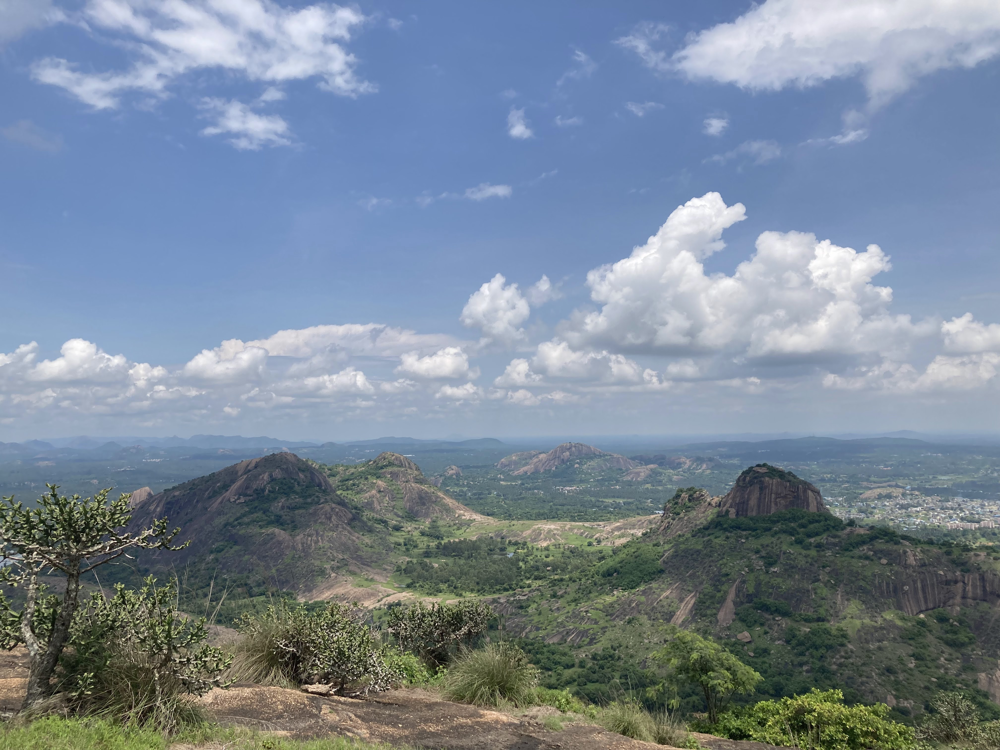
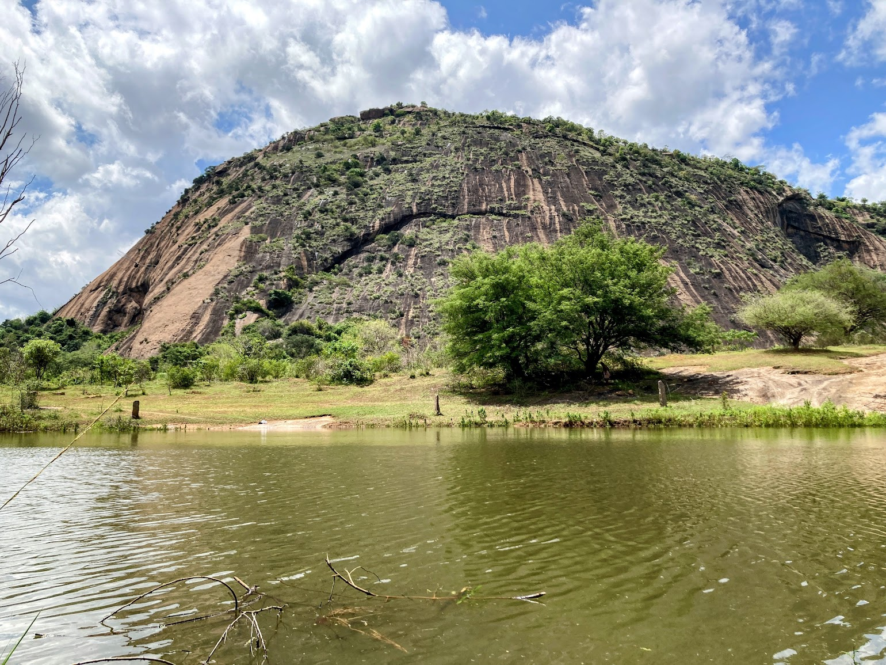

🧘🏼 _find your tribe on the trail_

Welcome to the inaugural edition of Serendipity Hikes. Grab some friends, lace up your hiking boots, and get ready for adventures you have been yearning for.

## ⛰️ Episode 1 - Handi Gundi Hilltop

**Location**: 60-65kms from Bangalore. Near Ramanagara (Bangalore-Mysore Expressway)
[Google Maps](https://maps.app.goo.gl/7NiHWDkgGP24HGMZ7) (just for the location, don’t bother reading reviews)

**Trail**: Easy 3.5 kms, 2 hrs

🚗 Start from your homes no later than 6am. The earlier we go, the lesser chances of ☀️

🥯 We can stop for some quick breakfast in Bidadi which is the OG Thatte Idly town. [Guru Thatte Idly](https://maps.app.goo.gl/GwCbq2tWghqG4MuMA) is popular and they open very early

🧗🏼‍♂️Aim is to start our hike by 8am. Some flat trails and some rocky ascends but overall an easy hike. Make sure you wear shoes with good grip. Overall ascent is not more than 250 mts. 45mins one side. We should be done in about 3 hrs with lots of rest and good memories

🌊 If we feel that the hike is going to be complicated then there is a pond nearby which can be an alternative to chill and relax. Some say you can swim, but do this at your own risk

# 🔔 Things to carry

- Good shoes
- Sunglasses
- Cap
- Sunscreen
- Water (+electrolytes if you have)
- Rain Jacket
- Small Snacks (optional)